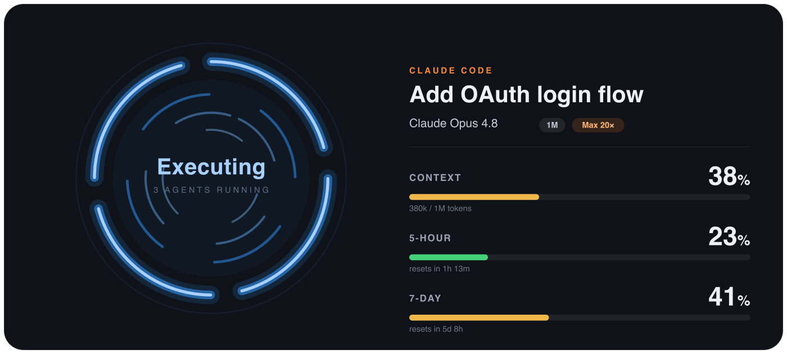
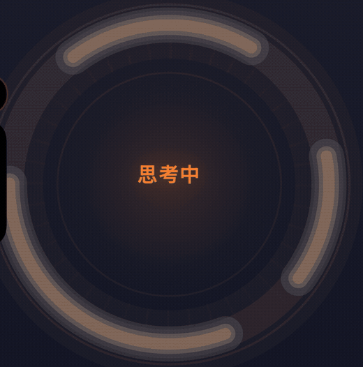

# Awaitlight

**Turn any spare phone into a live status display for your AI coding agents.**



Awaitlight runs a tiny local server on your computer and serves a landscape web UI you open
on a spare phone. Prop the phone next to your keyboard and, at a glance, you can see what
your agents are doing without alt-tabbing into a terminal.

## What it is

A glance tells you whether an agent is **running**, **thinking**, **waiting on you**, or
**idle** — plus the **context window** it has left and how close you are to your **usage
limits**. When several agents are active, it shows a small monitoring wall; when one is
active, it shows a large status halo with model, context, and limits. When nothing is
running, a little original pixel companion keeps the screen alive.

It reads agent activity locally on your machine — nothing about your code or sessions
leaves your network.

Here's the halo reacting while an agent thinks:



### Works with

Awaitlight works with **Claude Code**, **Codex**, **Cursor**, and **Claude Cowork**. These
names are used only to describe interoperability.

> Awaitlight is an independent project. It is **not affiliated with, endorsed by, or
> sponsored by** Anthropic, OpenAI, or Anysphere.

## Quick start

```bash
node server.js
```

The server prints a LAN address (something like `http://192.168.x.x:8787`).

1. On a spare phone **on the same Wi-Fi**, open that address in the browser.
2. Turn the phone **landscape** and prop it up.
3. **Save it as a bookmark on your home screen** — do **not** use "Add to Home Screen".
   A bookmark opens in the normal browser, which keeps the live connection and screen-wake
   behavior working the way Awaitlight expects.

To set a different port:

```bash
PORT=8799 node server.js
```

A control panel for themes, language, and the idle companion is available at the printed
`…/control` address (open it on your computer).

## Features

- **At-a-glance state** — running / thinking / waiting-on-you / idle, shown as a status halo.
- **Context & limits** — remaining context window and progress toward your usage limits.
- **Multi-agent wall** — several active agents tile into a monitoring grid.
- **Idle companion** — an original pixel creature plays on screen when nothing is running.
- **Stays awake** — keeps the phone screen on while it's acting as a display.
- **Local only** — reads agent activity on your own machine.

### Themes

A handful of color themes (set them from the `…/control` panel), so the display matches your
desk. Language can be switched between English and Chinese.

### Custom companion

You can replace the built-in idle creature with your own art by defining
`window.AWAITLIGHT_PET` on the page — see [`pets/README.md`](pets/README.md). Bring your own
sprite; you are responsible for the rights to whatever art you use. Awaitlight ships only its
own original creature.

## Brand

- Website: <https://awaitlight.com>
- Desktop client: <https://awaitlight.com/download>
- An ambient **hardware status light** is **coming soon** — join the waitlist at
  <https://awaitlight.com> to hear when it's ready.

## License

Awaitlight is **dual-licensed**:

- **Non-commercial use is free** under the **PolyForm Noncommercial License 1.0.0** — see
  [`LICENSE`](LICENSE).
- **For commercial use**, contact <hello@awaitlight.com> to purchase a commercial license.

Third-party components and trademark notices are listed in
[`THIRD-PARTY-NOTICES.md`](THIRD-PARTY-NOTICES.md).
